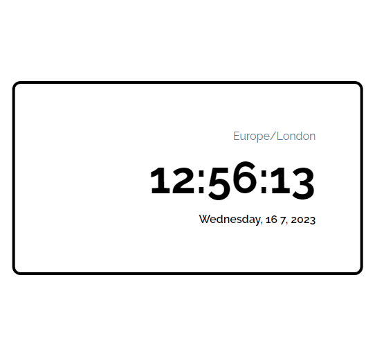

# Time-Zone Project
## Project Overview
This is a simple JavaScript project that displays the time and timezone of the current user together with the current date of the user.
## Tech Stack
The project is built with HTML for the markup and CSS together with Tailwind CSS for styling, and JavaScript with the dayJs library for the functionality of the project.
## Screenshot
 